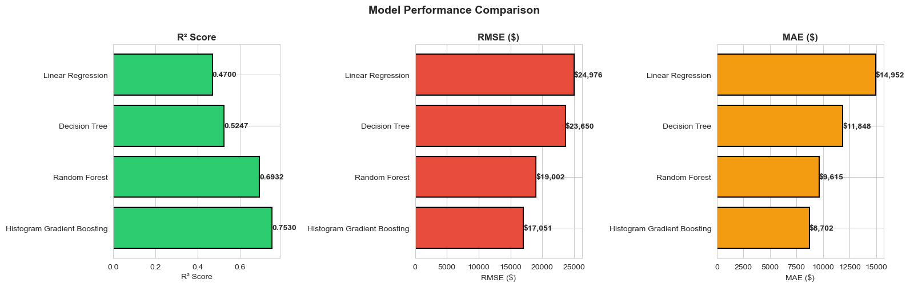
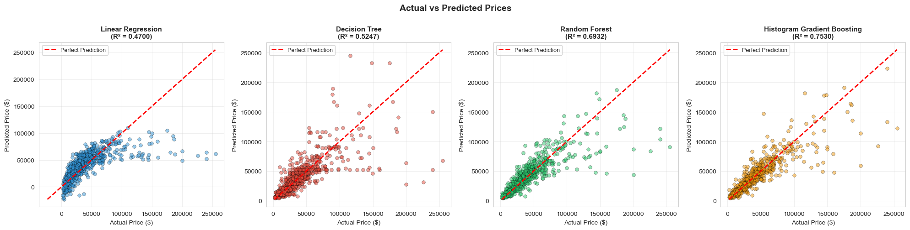

# Used Car Price Prediction — Machine Learning Project

A regression project that predicts used car prices from listing data, comparing four
machine learning algorithms end-to-end: data cleaning, feature engineering,
hyperparameter tuning, evaluation, and interpretation.

**Author:** Daniel Osei 

## Overview

The notebook builds and compares four regression models to predict used car prices:

- Ridge Regression (linear baseline)
- Decision Tree Regressor
- Random Forest Regressor
- Histogram Gradient Boosting Regressor

Each model is tuned with `GridSearchCV` (5-fold cross-validation) and evaluated on a
held-out test set using R², RMSE, and MAE.

## Repository contents

| File / folder | Description |
|---|---|
| `used_car_price_prediction.ipynb` | Main notebook: cleaning, EDA, feature engineering, modelling, evaluation |
| `used_cars_price_prediction.csv` | Raw dataset (~25K used car listings) |
| `figures/` | Exported charts referenced in the write-up |
| `report.docx` | Full written report (methodology, results, discussion) |
| `walkthrough_video.mp4` | Recorded walkthrough of the project |

## Project workflow

1. **Data cleaning** — parses numeric fields stored as strings (`price`, `milage`),
   extracts horsepower / engine size / cylinder count from the free-text engine
   description, removes top-1% price outliers, and log-transforms the target to fix
   right-skew.
2. **Exploratory data analysis** — visualises the price distribution before/after the
   log transform and median price by brand.
3. **Feature engineering** — label-encodes categorical fields (brand, fuel type,
   transmission); engineers `car_age`, `milage_per_year`, and `power_per_liter`;
   imputes missing values (median strategy); scales numeric features.
4. **Modelling** — trains and grid-searches all four regressors (80/20 train-test
   split).
5. **Evaluation** — compares R², RMSE, and MAE across models; visualises actual vs.
   predicted prices, residuals, and error distributions.
6. **Feature importance** — permutation importance on the best-performing model.
7. **Inference example** — predicts the price of a sample 2022 car with all four
   models plus an ensemble average.

## Results at a glance

See `figures/02_model_comparison_r2_rmse_mae.png` for the full model comparison and
`report.docx` for detailed metrics and discussion.




## How to run

```bash
git clone <this-repo-url>
cd used-car-price-prediction
pip install -r requirements.txt
jupyter notebook used_car_price_prediction.ipynb
```

Run all cells from top to bottom. `GridSearchCV` dominates runtime — expect roughly
15–20 minutes total depending on hardware.

## Requirements

See `requirements.txt`. Core libraries: pandas, numpy, matplotlib, seaborn,
scikit-learn.
